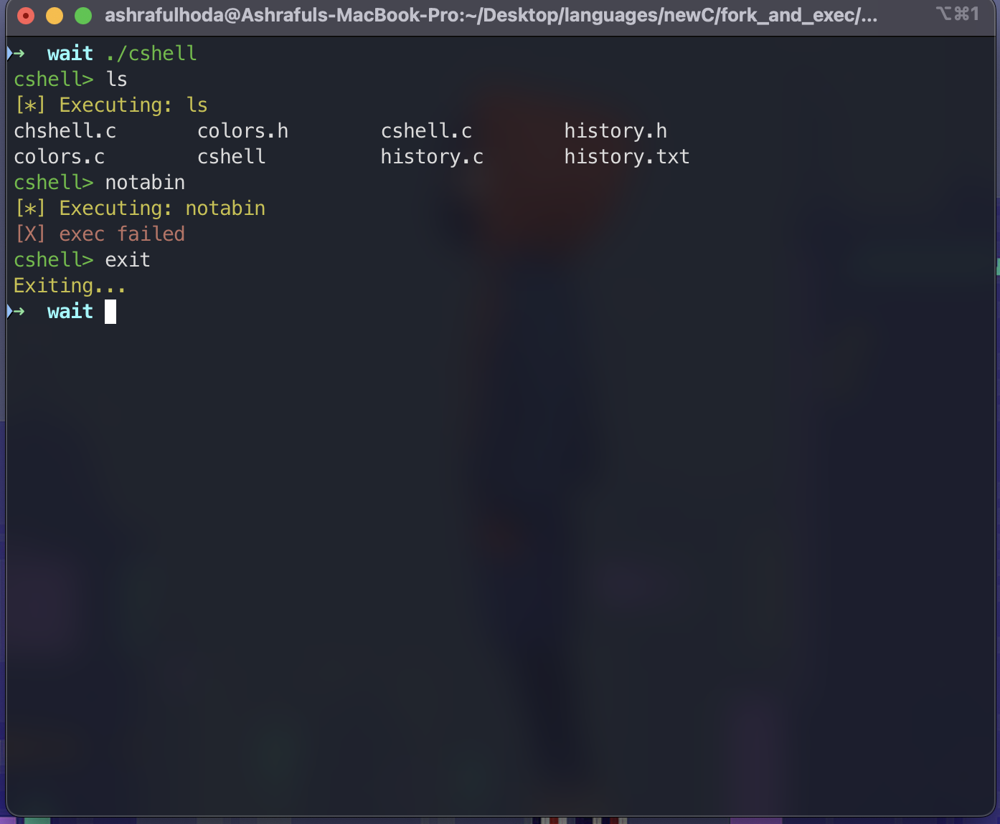

# 🐚 cshell — A Simple Custom Shell in C

## 📌 Project Description
**cshell** is a lightweight shell written in C that demonstrates the fundamentals of **systems programming**.  
It allows users to execute commands, manage processes, and log command history.

---

## 🔧 Features
- Custom shell prompt (`cshell>`) in **green**.
- Executes external programs using `fork()` and `execvp()`.
- Tracks each command’s **PID** and **exit status**.
- Saves command history to `history.txt`.
- Modular design:
  - `history.c / history.h` → history management
  - `colors.c / colors.h` → colored output utilities

---

## 💡 Learning Goals
This project is built to practice:
- Process creation with `fork()`
- Running executables with `execvp()`
- Waiting for processes via `waitpid()`
- Using structs and pointers in C
- Modular programming with headers and multiple `.c` files
- ANSI escape codes for terminal colors

---



## 🚀 Compilation & Usage
Compile all source files together:

```bash
gcc cshell.c history.c colors.c -o cshell


